<p align="center">
  <a href="https://locha.io/">
  
  </a>
  <br/>
  <a href="https://travis-ci.com/btcven/radio-firmware">
    
  </a>
</p>

<p align="center">
  <a href="https://locha.io/">Project Website</a> |
  <a href="https://locha.io/donate">Donate</a> |
  <a href="https://github.com/sponsors/rdymac">Sponsor</a> |
  <a href="https://locha.io/buy">Buy</a>
</p>

<h1 align="center">Implementacion del protocolo de enrutamineto AODVv2 </h1>

<h1 align="left"> Tabla de Contenido</h2>

- [Introduccion](#introduccion)
- [AODVv2](#aodvv2)
  - [Describiendo de forma general el protocolo](#describiendo-de-forma-general-el-protocolo)
  - [Diagrama de flujo general del funcionamiento de un nodo.](#diagrama-de-flujo-general-del-funcionamiento-de-un-nodo)
  - [Router Client Set](#router-client-set)
  - [Neighbor Set](#neighbor-set)
  - [Sequence Number](#sequence-number)
  - [Local Route Set](#local-route-set)
  - [Multicast Route Message Set](#multicast-route-message-set)
  - [Mensajes](#mensajes)
    - [Contenido del mensaje  de requerimiento de ruta RREQ](#contenido-del-mensaje-de-requerimiento-de-ruta-rreq)
    - [Contenido del mensaje de respuesta de ruta RREP](#contenido-del-mensaje-de-respuesta-de-ruta-rrep)
    - [Contenido del Mensaje RREP_Ack](#contenido-del-mensaje-rrepack)
  - [Procesos involucrados en el protocolo AODvv2](#procesos-involucrados-en-el-protocolo-aodvv2)
    - [Next Hop Monitoring](#next-hop-monitoring)
    - [Neighbor Set Update](#neighbor-set-update)
  - [Procesado de la información de los mensajes de ruta](#procesado-de-la-informaci%c3%b3n-de-los-mensajes-de-ruta)
    - [Evaluación de la información de ruta](#evaluaci%c3%b3n-de-la-informaci%c3%b3n-de-ruta)
    - [Actualización dela información de las rutas](#actualizaci%c3%b3n-dela-informaci%c3%b3n-de-las-rutas)
    - [Eliminación de los mensajes redundantes usando la Multicast Route Message Set](#eliminaci%c3%b3n-de-los-mensajes-redundantes-usando-la-multicast-route-message-set)
    - [Creación de mensajes RREQ](#creaci%c3%b3n-de-mensajes-rreq)
    - [Recepción de mensajes RREQ](#recepci%c3%b3n-de-mensajes-rreq)
    - [Reenvío de mensajes RREQ](#reenv%c3%ado-de-mensajes-rreq)
    - [Recepciónde mensajes RREPE](#recepci%c3%b3nde-mensajes-rrepe)
    - [Reenvíode mensajes RREP](#reenv%c3%adode-mensajes-rrep)
    - [Generación de mensajes RREP_Ack Request](#generaci%c3%b3n-de-mensajes-rrepack-request)
    - [Recepción de mensajes RREP_Ack](#recepci%c3%b3n-de-mensajes-rrepack)
    - [Generación de RREP_Ack Response](#generaci%c3%b3n-de-rrepack-response)
  - [Formato de paquetes para redes MANET](#formato-de-paquetes-para-redes-manet)
  

# Introduccion

El objetvo de este proyecto es la implementacion del protocolo **AODVv2**, el cual se enmarca en uno de mayor envergadura que 
comprende las siguientes fases.

1. Implementacion del protocolo **AODVv2** en un entorno basado en un sistema operativo embebido, en este caso  [RIOT-OS](https://www.riot-os.org/).
2. Verificar  el  rendimiento  del protocolo **AODVv2** en  escenarios reales y contrastarlo con lo previsto por el marco teórico
desarrollado con anterioridad.


El protocolo AODVv2 enfrenta algunos desafios para poder trabajar de manera optima en las areas de aplicacion provistas para este tipo de resdes, como lo son :


<ul class="w3-ul w3-border">
  <li><h4>Topologia dinamica.</h4></li>
  <li><h4>Restricciones de recursos(hardware).</h4></li>
  <li><h4>heterogeneidad entre nodos(diferencias en el hardware).</h4></li>
</ul>


# AODVv2

<p  class="w3-ul w3-border">
Las redes ad hoc han ganado popularidad y se aplican en una amplia gama de aplicaciones, como la seguridad pública y las redes de respuesta a emergencias. Las redes móviles ad-hoc (MANET) son redes autoconfigurables que admiten la comunicación de banda ancha sin depender de la infraestructura cableada. Los protocolos de enrutamiento de redes ad-hoc son factores principales que determinan el rendimiento y la fiabilidad de estas redes.
Especifican la forma de comunicación entre los diferentes nodos al encontrar rutas apropiadas en las que se deben enviar los paquetes de datos.
</p>

## Describiendo de forma general el protocolo 

El protocolo **AODVv2** se deriba de un trabajo anterior llamado **DYMO**, que nacio en Julio del 2005y en el an'o 2013 adopta el nombre de **AODVv2**, en la siguiente figura podemos observar las diferentes versiones de AODVv2 y DYMO.

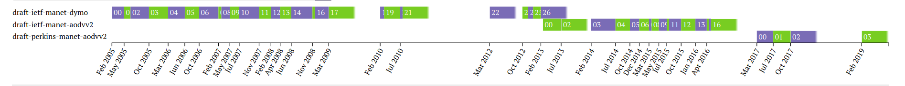

En este trabajo, nos centramos en la evolución del protocolo de enrutamiento (AODV) llamado protocolo de enrutamiento AODVv2.

**AODV** es uno de los cuatro protocolos estandarizados por el grupo de trabajo **IETF MANET**. El protocolo encuentra rutas alternativas bajo demanda siempre que sea necesario, lo que significa que primero se pretende establecer una ruta entre un nodo de origen y un destino **(descubrimiento de ruta)**, y luego mantener una ruta entre los dos nodos durante los cambios de topología **(mantenimiento de la ruta)**.


Cuando un router AODVv2 precisa encontrar un camino hacia un destino, inicia el proceso de descubrimiento de ruta. El nodo origen transmite un ```Route Request Message``` **(RREQ)**,que contiene la IP del nodo que ha generado el RREQ y la dirección IP o dirección de red para la cual desea encontrar una ruta. Cada host que recibe el RREQ guarda la dirección IP del emisor del paquete RREQ. Por otro lado si el host que recibe el RREQ no es el destino para el cual se inició el descubrimiento de ruta, reenvía el RREQ. Cuando el HOST para el cual se inició el  descubrimiento  de  ruta  recibe  el  mensaje  RREQ,  envía  un Route  Reply Message(RREP) hacia el host que genero el RREQ, cuando este lo recibe, se da por finalizado el proceso de descubrimiento de ruta. 

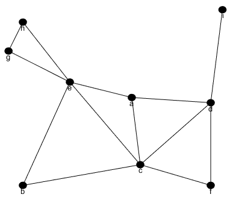


En la Figura anterior podemos observar el proceso de descubrimiento de ruta, la cual se inicia desde el nodo **d** como originador del RREQ y finaliza en el nodo **h** como entidad que inicia la devolucion de un mensaje **route reply**, para afirmar que es el destino que se desea encontrar, y dicho mensaje sera devuelto a traves dela ruta que seaprendio del mensaje de solicitud de busqueda, debido a que en una solicitu de ruta, el nodo que recibe el mensaje debera almacenar informacion del nodo que envio el requerimiento de ruta , como alternativa para aprender una ruta de regreso hacia su vecino.

```Descripcion visual de como se inunda completamente la red en busca de una ruta especifica```.
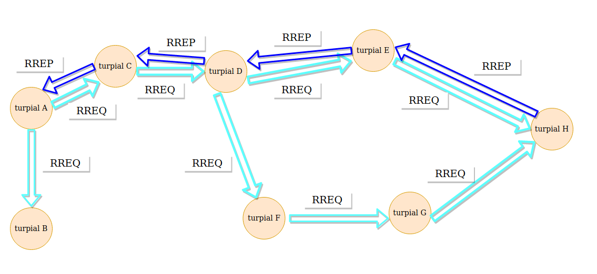


El mantenimiento de las rutas de las tablas de encaminamiento es el proceso mediante el cual el  algoritmo asegura que las rutas activas  de  la  tabla  de encaminamiento siguen  siendo  válidas.  Para  realizar  esta  tarea  se  utiliza  los Route Error Message(RERR), estos mensajes de control los genera un router AODVv2 cuando quiere informar a uno o varios nodos de que una o varias rutas han dejado de ser válidas. Hay tres eventos que provocan él envió de un mensaje RERR:

- Cuando un nodo tiene que reenviar un paquete IP pero no existe una ruta válida en su tabla de encaminamiento. En este caso el nodo enviara un RERR a la fuente para informar que no existe una ruta hacia el destino.
- Cuando no se puede reenviar un mensaje RREP porque la ruta hacia el generador del RREQ no es válida. En este caso el nodo debe enviar en RERR hacia el generador del mensaje RREP para infórmale que la ruta hacia el origen del mensaje RREQ no es válida.
- Cuando un nodo detecta que uno de los enlaces de un vecino se ha roto, debe informar a todos los nodos que usan ese enlace de todas las rutas que han pasado a ser invalidas.

## Diagrama de flujo general del funcionamiento de un nodo.

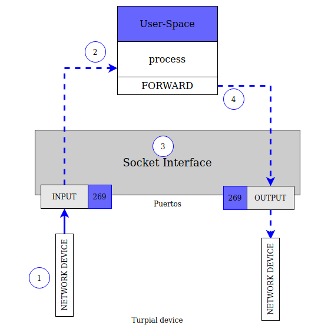
 
- En el punto 1 llegan todos los paquetes a traves de la interface de red.
- En el punto 3 la API de sockets permite recibir y enviar paquetes por el puerto 269.
- En el punto 2 el nodo procesa el Paquete y segun el caso envia un RREP o RREQ por medio de 4.

 <br>

En este punto hemos hecho una descripcion muy general acerca de ocmo funciona el protocolo de ruteo AODVv2. En las siguientes secciones describiremos los procesos involucrados, mensajes implementados y las estructuras de datos necesarias para completar la tarea.

Hasta ahora se ha presentado una descripción general del funcionamiento del protocolo AODVv2. En los sucesivos apartados de este capítulo se entrará en profundidad en los procesos, estructura de datos y mensajes implementados y testados en escenarios reales. Estos procesos se enmarcan en el procedimiento de descubrimiento de la ruta. Dicha operación engloba varios procesos y hace uso  de  estructuras de datos para almacenar entre otras la información  de  las rutas.

## Router Client Set
Un router AODVv2 solo ofrece el servicio de descubrimiento  de rutas a sus aplicaciones locales, y a los clientes registrados en el **Router Client Set**, y solo generará mensajes RREQ y RREP en nombre de los clientes que se encuentren registrados en ella.

## Neighbor Set
La tabla Neighbor Set contiene información relativa a los routers vecinos. Esta se actualiza a partir de los mensajes de control. También contiene información relativa a la bidireccionalidad del enlace, una ruta solo se considerará valida cuando se confirme que el enlace es bidireccional.

## Sequence Number
Los números de secuencia permiten a los encaminadores AODVv2 determinar el orden temporal de los mensajes de descubrimiento de ruta, identificando la información de enrutamiento obsoleta para que pueda descartarse.Cada router AODVv2 debe mantener su propio Sequence Number, este se incluye en todos los mensajes RREQ y RREP creados por él.

## Local Route Set

Todos los routers AODVv2 deben mantener un conjunto de rutas locales, esta contiene información sobre las rutas aprendidas a partir de los mensajes de control. Cuando una ruta se considere válida se deberá añadir la entrada correspondiente en la tabla de rutas, y cuando una ruta pasa de válida a inválida se debe borrar la entrada correspondiente en la tabla de rutas.

## Multicast Route Message Set

Los mensajes RREQ(Route Request) por defecto son multicast y estos pueden ser reenviados varias veces. El multicast route message set tiene como finalidad proporcionar información relativa a los mensajes RREQ y RREP que han sido recibidos previamente, y de esta manera poder compararlos con los mensajes de ruta recibidos y determinar si la información que contienen es antigua. Esto permite al router controlar el envío de tráfico redundante.

## Mensajes

En este apartado se definen los mensajes de control que el protocolo utiliza para comunicar entre nodos información relativa a las rutas. AODVv2 define 4 tipos de mensajes de control:

- Route Request (RREQ).
- Route Reply (RREP).
- Route Reply Acknowledgement (RREP_Ack).
- Route Error(RERR). 

### Contenido del mensaje  de requerimiento de ruta RREQ

<p> 
 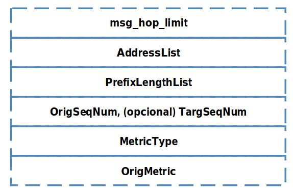

- **msg_hop_limit**: Contiene un número entero que decrece en 1 cada salto que  atraviesa el mensaje  RREQ.  El  RREQ_Gen  establece  el  número máximo de saltos que atravesará el mensaje RREQ.
- **AddressList**: Contiene OrigPrefix y TargPrefix.
- **PrefixLengthList** (Opcional): Contiene OrigPrefixLen, si se omite,la longitud del prefijo (en bits) es igual a la longitud de la dirección OrigAddr.
- **OrigSeqNum** :Número de secuencia de OrigPrefix.
- **MetricType**: Tipo de métrica asociada con OrigMetric.
- **OrigMetric**: El valor de la métrica asociada a la ruta a OrigPrefix
</p>

<br></br>

### Contenido del mensaje de respuesta de ruta RREP

<p> 
 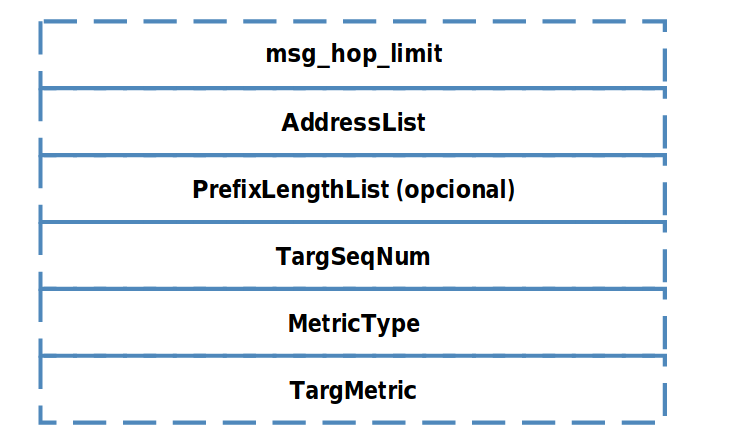

- **msg_hop_limit**: msg_hop_limit: Contiene un número entero que decrece en 1 cada salto que  atraviesa  el  mensaje  RREP.El  RREP_Gen  establece  el  número máximo de saltos que atravesaráel mensaje RREP.
- **AddressList**: Contiene OrigPrefix y TargPrefix.
- **PrefixLengthList** (Opcional): Contiene  TargPrefixLen,  si  se  omite,la longitud del prefijo (en bits) es igual a la longitud de la dirección TargAddr.
- **TargetSeqNum** :El número de secuencia asociado a TargPrefix.
- **MetricType**: El tipo de métrica asociada aTargMetric.
- **TargetMetric**: El valor de la métrica asociada con la ruta a TargPrefix.
</p>
<br></br>

### Contenido del Mensaje RREP_Ack
<p> 
 

- **AckReq** (Opcional): Si se incluye, informa al receptor debe enviar un RREP_Ack response para confirmar la bidireccionalidad del enlace
</p>
<br>

## Procesos involucrados en el protocolo AODvv2

A continuacion se dara un descripcion corta de cada uno los procesos involucrados en el protocolo.

### Next Hop Monitoring

Este proceso tiene como finalidad asegurar que no se establecen rutas a través de enlaces  unidireccionales, para ello los routers AODV2 deben verificar la bidireccionalidad del enlace con el siguiente salto antes de marcar una ruta como válida en el local route set.

- Para comprobar si un enlace es bidireccional con un router upstreamse utiliza el mensaje de control Route Reply Acknowledgement (RREP_Ack). Al enviar un RREP_Ack, se espera un RREP_Ack como respuesta, si este llega en un tiempo menor a RREP_Ack_SENT_TIMEOUT demuestra que el enlace esbidireccional, en caso contrario el enlace se considera unidireccional.
- Para un router downstream,el hecho de recibir un mensaje RREP que contiene en el campo TargAddr la dirección destino de una solicitud de ruta, es una confirmación de que el enlace está activo y es bidireccional, ya que, un mensaje RREP requiere que un mensaje RREQ previamente haya recorrido el enlace en dirección contraria.

### Neighbor Set Update

- Este proceso tiene como finalidad de actualizar la tabla Neighbor Set. Cuando se recibe un mensaje de control se inicia el proceso para actualizar la tabla Neighbor Set, esto permite registrar los vecinos del router AODVv2 y establecer la relación que mantiene con cada una de ellos. 

- Cuando un router recibe un mensaje RREP y se esperaba su recepción,el enlace con el router que ha enviado el paquete es confirmado como bidireccional, y por lo tanto el estado de la entrada correspondiente de la NeighborSet cambia a Confirmed. 
- Cuando un router recibe un mensaje RREP_Ack y este es debido al envío de un RREP_Ack con AckReq. El enlace es confirmado como bidireccional y se tiene que actualizar la tabla Neighbor Set.

## Procesado de la información de los mensajes de ruta

En todos los mensajes de ruta hay información sobre una ruta, los RREQ contienen la ruta hacia OrigPrefix, y los RREP hacia TargPrefix.Esta información se almacena en Local Route Set. 

Como paso previo al proceso de evaluación, se convierten las estructuras de los mensajes RREQ y RREP a una estructura tipo AdvRte,común para ambos, esto facilita el proceso de desarrollo reduciendo el número de funciones a implementar.


### Evaluación de la información de ruta

Este proceso  tiene  como  finalidad evaluar si la información de la ruta que contiene el AdvRte se utilizará para actualizar la tabla Local Route Set, para ello se compara el coste y el número de secuencia del AdvRte con la entrada correspondiente en la tabla Local Route Set.

### Actualización dela información de las rutas

Después de determinar que el AdvRte se utilizará para actualizar Local Route Set, este proceso se encarga de añadir una nueva entrada en la Local Route Set o actualizar una existente.

### Eliminación de los mensajes redundantes usando la Multicast Route Message Set

Cuando los mensajes de ruta inundan una MANET, un nodo podría recibir varias veces el mismo mensaje de ruta, si no se evita, parte de estos mensajes serán reenviados generando trafico innecesario.

Para solucionar este problema cada router AODVv2, almacena información de los mensajes de ruta que recibe en la tabla Multicast Route Message Set.

Cada vez que se recibe un mensaje RREQ o RREP,se consulta en la tabla Multicast Route Message Set, si la información que contiene el mensaje entrante es redundante o no.

A partir de esto se toma la decisión si el mensaje es reenviado o no.

### Creación de mensajes RREQ
Un mensaje RREQ se genera cuando un Client Router registrado en la tabla Local Route Set de un router AODVv2 quiere enviar un paquete IP y no existe una ruta hacia al destino en su tabla RIB.Tras configurar los parámetros descritos [aqui](#Contenido-del-mensaje-de-requerimiento-de-ruta-RREQ),se procedea su envío. La dirección IP de destino del paquete que contiene el mensaje RREQ será la dirección multicast FF02:0:0:0:0:0:0:6D para IPV6.

### Recepción de mensajes RREQ
Este proceso se encarga de realizar las operaciones a efectuar cuando un router AODVv2 recibe un mensaje RREQ. Entre ellas: 
- Chequea el contenido de los campos para comprobar que son válidos.
- Actualiza las tablas Neighbor Set, Local Route Set y Multicast Route Message Set.  - Por último si la solicitud de descubrimiento de ruta va dirigida a él, envía un mensaje RREP. Si no es así reenvía el mensaje RREQ.

###  Reenvío de mensajes RREQ
Un mensaje RREP se genera cuando un nodo recibe un RREQ y el campo AdressList.TargPrefix del mensaje coincide con una entrada de la tabla Router Client Set del router. Cuando esto sucede genera un mensaje RREP configurando los campos descritos [aqui](#Contenido-del-mensaje-de-respuesta-de-ruta-RREP) lo envía en dirección al RREQ_Gen.

### Recepciónde mensajes RREPE
ste proceso se encarga de realizar las operaciones a efectuar cuando un router AODVv2 recibe un mensaje RREP. Entre  ellas chequea  el contenido de los campos para comprobar que son válidos, actualiza las tablas Neighbor Set, Local Route Set y Multicast Route Message Set.Sí el destino final del mensaje es el propio router, y el mensaje contiene una ruta valida se da por finalizado el proceso de descubrimiento de ruta, añadiendo la entrada correspondiente a la tabla de enrutamiento.


### Reenvíode mensajes RREP 
Este proceso tiene como finalidad el reenvío de los mensajes RREP, para ello comprobará si no se ha superado el número de saltos máximo, si es así reenvía el mensaje.

### Generación de mensajes RREP_Ack Request
Un mensajeRREP_Ack será generado si un mensaje RREP se envía por un enlace del cual se desconoce si es bidireccional.El RREP_Ack Request se enviará a LocalRoute [OrigPrefix].NextHop a través de LocalRoute [OrigPrefix].NextHop Interface. La entrada para Local Route [OrigPrefix].NextHopen la tabla Neighbor Set se actualizará siguiendo el proceso definido [aqui](#Neighbor-Set-Update)

### Recepción de mensajes RREP_Ack
Cuando un router AODVv2 recibe un RREP_Ack, comprobará si el mensaje contiene un AckReq y si el mensaje era esperado o no.Sí el mensaje contiene
un AckReq iniciara el proceso para enviar un RREP_Ack Response, si no es así y el mensaje era esperado actualizará la tabla Neighbor Set para establecer el enlace con el emisor del RREP_Ack como bidireccional.

### Generación de RREP_Ack Response
Un router AODvv2 generará un RREP_Ack Response cuando reciba un RREP_Ack que contenga un AckReq.


## Formato de paquetes para redes MANET

AODVv2 especifica en su draft que los mensajes de control tienen que mapearse en  un contenedor llamado Generalized Mobile Ad Hoc Network (MANET) Packet/Message Format[RFC5444. Este formato de paquete proporciona un encapsulado único para múltiples protocolos de encaminamiento Ad Hoc.

El RFC5444 dota de una mayor eficiencia a las trasmisiones de los mensajes de control, estructura de tal manera el contenido que reduce el número de bytes a transmitir.

El formato RFC5444 define los siguientes elementos:
- Paquete:Es la entidad de mayor nivel. Un paquete contiene una cabecera y cero o más mensajes.
- Mensaje:  Es  la  entidad  que  transporta  la  información  del  protocolo.  Un mensaje estáformado por una cabecera, un bloque TLV y un bloque de direcciones.
- Bloque  de  direcciones: Está formado por una o más direcciones, y un bloque de atributos.
- Bloque TLV: Está formado por uno o másTLV.
- TLV: Es una estructuraque tiene la forma “type-length-value”. Donde 
  - Type: Es el identificador del tipo de dato que viene a continuación.
  - Length: Este campo indica cuantos bytes ocupa el campo value.
  - Value: Es el valor concreto del objeto al que se refiere.

En la siguiente imagen se representa la estructura de un paquete RFC544 y sus dependencias.

 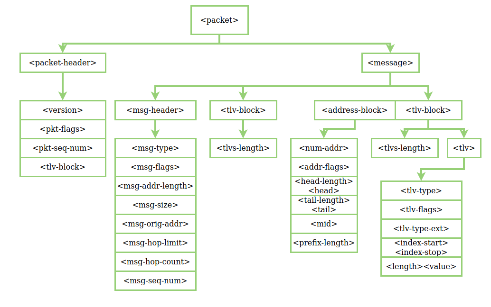

 Cada tipo de mensaje de control se tiene que adaptar al formato del paquete RFC5444.
 Para esto primero vamos a revisar cuales son los campos de cabecera del paquete RFC5444 que AODVv2 utiliza.


AODVv2 utilza los siguientes campos del mensaje Header RFC5444

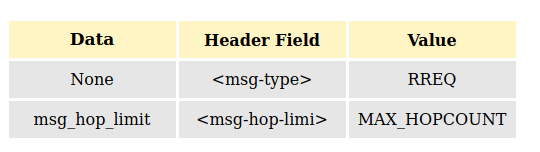

<br>

<h3> El address block esta formado por:</h3>

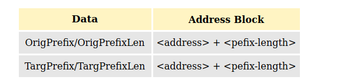

<h3> El TLV para OrigPrefix estará formado por:</h3>

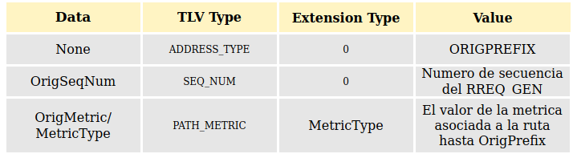

<h3>El TLV para TargPrefix estará formado por:</h3>

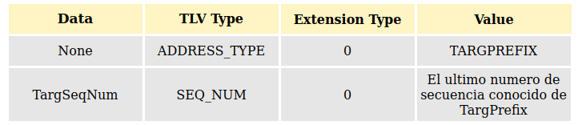


